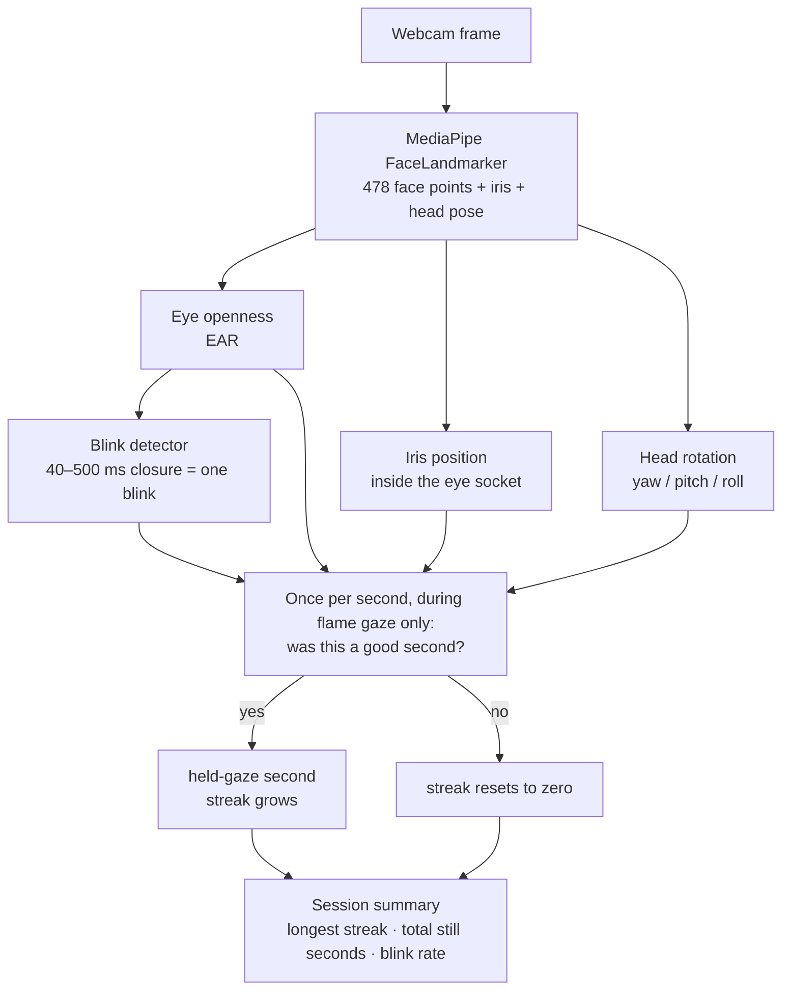

# Drishti

**A daily attention practice that measures how steadily you can hold your gaze — using nothing but a laptop webcam.**

Eleven minutes, once a day. You sit, settle your body, breathe, and then hold your gaze on a candle flame. While you do, the webcam watches your eyes and works out how long you actually held still — how often you blinked, whether your gaze drifted, whether you turned your head.

No video ever leaves your machine. All the vision processing runs on-device.

> *drishti* (Sanskrit): *the gaze, the way of seeing.*

<!-- TODO: add the Vercel URL and 2–3 screenshots here. This is the first thing a visitor sees.
     Suggested: the flame-gaze screen, the summary card, and the Record page.
     **[Try it →](https://your-app.vercel.app)**
     <p align="center"> …</p>
-->

---

## How it works



There are three layers to it, and they run at different speeds.

### 1. Every frame — what the eyes are doing

[`faceLandmarks.ts`](src/lib/faceLandmarks.ts) runs MediaPipe on each video frame and returns three things:

| Signal | How it's computed | What it means |
|---|---|---|
| **Eye openness** | Eye Aspect Ratio — six points per eye, (vertical gaps) ÷ (horizontal width) | ~0.30 open, ~0.10 closed. It's a *ratio*, so it doesn't change when you lean closer or tilt your head |
| **Iris position** | Iris centre rescaled to 0–1 *within its own eye socket* | 0.5 = looking straight ahead. Measured against the eye's own corners, so moving your head doesn't fake it |
| **Head rotation** | Euler angles from MediaPipe's 4×4 head-pose matrix | Catches you turning your head to glance at a screen corner — which iris position alone would miss |

### 2. Before you start — the baseline

While the camera is warming up and before you press Begin, the app quietly collects **90 clean frames (~3 seconds)** and takes the **median** iris position and head pose. That median becomes "looking at the flame," and everything during the session is measured as a deviation from it.

This is why there's no calibration dot to stare at. It also means the reference point is captured while you're sitting naturally, not while you're consciously holding still.

### 3. Once per second — was that a good second?

During the flame-gaze rounds only, a 1 Hz tick asks six questions. **All six** must be true:

- Face seen within the last 1.5 s
- Eyes open (EAR > 0.18)
- No blink during this second
- Signal quality not `poor`
- Iris within **±0.08** of baseline
- Head within **±0.15 rad (8.6°)** of baseline on all three axes

Yes → a `1` goes into the array and the streak grows. No → a `0`, and the streak resets to zero.

Blinks are detected by a separate little state machine watching eyelid gap cross a hysteresis band, counting a blink when a closure lasts **40–500 ms** with at least 120 ms since the last one. Closures longer than 500 ms are logged separately — those aren't blinks, they're eyes closing.

---

## The session

Every phase and timing lives in one file, [`src/lib/sessionScript.ts`](src/lib/sessionScript.ts). Total: **660 seconds = 11:00**, guarded by a unit test.

| # | Phase | Duration | Structure |
|---|---|---|---|
| 1 | Settle | 30s | 2 × 15s posture / breath instructions |
| 2 | Body release | 96s | 8 regions (feet → face). Each: 8s tense + 4s release |
| 3 | Breath | 120s | 10 paced cycles. Each: 4s inhale + 8s exhale |
| 4 | **Flame gaze** | 300s | 5 rounds × 60s — *this is the only phase that's measured* |
| 5 | Eyes closed | 48s | 12s afterimage hold after gaze rounds 1–4 |
| 6 | Open awareness | 66s | Silent, eyes closed |

Ends with a gong, and a ~2.5s "afterglow" before the summary appears so the gong rings against the dissolving flame rather than a bright text card.

## What gets saved

Everything above collapses into a handful of numbers per sit (schema in [`supabase-schema-v4.sql`](supabase-schema-v4.sql)):

| Column | Meaning |
|---|---|
| `longest_gaze_sec` | Longest unbroken run of held-gaze seconds |
| `total_stillness_sec` | Total count of held-gaze seconds across all five rounds |
| `blink_rate_during_gaze` | Seconds *containing* a blink, per minute — note this saturates at 60 |
| `blink_count` | Total blinks detected |
| `gaze_stability_samples` | The raw per-second 0/1 array — drives the steadiness arc on the Record page |
| `duration_min` | Actual elapsed minutes (partial if ended early) |
| `feeling` | `Calm` / `Neutral` / `Restless` / `null` |
| `note` | Optional free-form text |
| `new_milestones` | Milestone IDs unlocked this sit |

Written to `localStorage` the instant the session completes, then synced to Supabase in the background — so closing the tab on the summary screen can't lose a sit.

---

## Tech stack

| Layer | Choice |
|---|---|
| Frontend | React 19 + TypeScript + Vite 7 |
| Routing | React Router v7 |
| Styling | Inline styles + a small [`index.css`](src/index.css) for keyframes / CSS variables. No CSS framework |
| Vision | MediaPipe Tasks Vision WASM — runs in-browser, no server |
| Auth | Supabase Auth — Google OAuth only |
| Database | Supabase Postgres — `sessions` + `profiles`, row-level security |
| Local cache | `localStorage` — the primary store; Supabase is background sync |
| Audio | HTML `<audio>` for beds/gong + Web Audio synthesis for transition tones |
| PWA | `vite-plugin-pwa` — service worker precaches audio + diya video |
| Deployment | Vercel — SPA rewrites + CSP / security headers via [`vercel.json`](vercel.json) |
| Testing | Vitest — script invariants and streak arithmetic |
| CI | GitHub Actions — typecheck + lint + tests on push / PR |

Fonts: **Samarkan** for the wordmark, **Mukta** Light/ExtraLight for all in-session text, **Playfair Display** for summary numbers and the daily quote, **DM Sans** as the body fallback.

---

## Project structure

```
src/
├── pages/
│   ├── OnboardingPage.tsx    # Landing (unauth): diya + wordmark + Google sign-in
│   ├── LoginPage.tsx         # Returning-user sign-in
│   ├── FoundationsPage.tsx   # One-time primer before the first session
│   ├── HomePage.tsx          # Authed home: diya + weekly card + Begin
│   ├── SessionPage.tsx       # The 11-min sit — state machine, tracking, audio, summary
│   ├── HistoryPage.tsx       # "Record" — mandala + trend lines + steadiness arc
│   ├── InstructionsPage.tsx  # Six-phase overview
│   ├── PhilosophyPage.tsx    # The practice, without jargon
│   ├── SciencePage.tsx       # Research summaries on trataka + attention
│   ├── PrivacyPage.tsx       # Data policy + sign out
│   └── AboutPage.tsx         # (Mobile only, older layout)
│
├── components/
│   ├── Layout.tsx            # Top nav shell
│   ├── BottomTabBar.tsx      # Mobile tab bar
│   ├── MeditationBackground.tsx  # Warm dark gradient + vignette + floor glow
│   ├── Diya.tsx / Flame.tsx  # SVG diya for landing / home
│   ├── BodyGuideOverlay.tsx  # SVG body figure, amber glow on the active region
│   ├── BreathGuide.tsx       # Pulsing orb driven by phase timing
│   ├── SettleHalo.tsx        # Concentric halos for settle + integrate
│   ├── BrushstrokeEyes.tsx   # Closed-eye brushstrokes
│   ├── ErrorBoundary.tsx     # Root-level render-error recovery
│   ├── UpdateBanner.tsx      # "A new version is ready" via useRegisterSW
│   ├── InstallPrompt.tsx     # PWA install banner
│   └── PublicPageNav.tsx     # Back-to-landing link
│
└── lib/
    ├── sessionScript.ts      # Single source of truth: every phase, timing, cue
    ├── sessionAudio.ts       # Intro bed, fire crackle, transition tones, gong
    ├── faceLandmarks.ts      # 478 landmarks → EAR + iris + head pose
    ├── faceDetection.ts      # MediaPipe FaceDetector init + snapshot
    ├── storage.ts            # localStorage + Supabase sync + profile cache
    ├── quotes.ts             # 48 daily quotes, cycled by mandala day
    ├── milestones.ts         # 48-day mandala + streak milestones
    ├── auth.ts               # Supabase session → local profile
    └── supabase.ts           # Supabase client
```

---

## Running it locally

**Prerequisites:** Node 20+, a Supabase project (free tier), a Google OAuth client wired to Supabase.

```bash
git clone https://github.com/kj2870/attentionstabilitytool.git
cd attentionstabilitytool
npm install
```

Create `.env` from [`.env.example`](.env.example):

```
VITE_APP_MODE=consumer
VITE_SUPABASE_URL=https://your-project.supabase.co
VITE_SUPABASE_ANON_KEY=your-anon-key
```

```bash
npm run dev       # http://localhost:5173
npm run build     # production build (runs tsc first)
npm run lint
npm run test
```

**Database:** paste [`supabase-schema-v4.sql`](supabase-schema-v4.sql) into the Supabase SQL editor and run it. That creates both tables, the RLS policies, and a signup trigger that auto-creates a profile row.

**Auth:** enable Google in Supabase → Providers, then add your local and production URLs to both Supabase's redirect list and the Google Cloud OAuth client.

---

## Design notes

**Warm dark.** `#0e0e10` background, amber `#ffb347` for active state and CTAs, off-white `#F5E9DA` text. Every gradient is terracotta / amber / cream — no cool blue anywhere.

**Slow motion on purpose.** Route fades are 900 ms. In-session cross-fades run 900–2400 ms. The diya bloom and the backdrop darkening are both 2400 ms and synchronized, so the flame arrives *into* darkness rather than after it. `prefers-reduced-motion` collapses all of it to instant cuts.

**The text never moves.** In-session copy lives in a fixed-height slot at the top, the visual is centred below it, progress sits at the bottom. Whatever phase you're in, the words are in the same place.

**Landing and Home never scroll** — `100dvh`, overflow hidden.

---

## Things worth knowing exist

- **Pause / resume mid-sit** — timer freezes, audio holds, state survives
- **End early** saves the real elapsed time rather than pretending
- **Wake lock** so the display can't dim mid-gaze
- **Camera-denied fallback** — the session still runs, the summary shows duration instead of a zeroed gaze stat, and a retry pill offers the camera again
- **48 daily quotes** cycled by mandala day, with real citations (Yoga Sutras, Gita, Upanishads, Dhammapada, Zen, Vedanta)
- **Bundle split** — `mediapipe`, `supabase` and `react` are separate chunks; main bundle went from ~500 KB to ~300 KB
- **Note-field disclosure** appears the moment you start typing, because the developer can read notes

## Engineering decisions

- **Local-first.** `localStorage` is the real store, Supabase is background sync. The app works offline after first load.
- **On-device vision.** Frames never leave the machine. MediaPipe runs as WASM in the browser.
- **One file owns the protocol.** Change [`sessionScript.ts`](src/lib/sessionScript.ts) and you've changed the practice. A test asserts the total is always exactly 660 s.
- **Client-generated UUIDs.** Session rows use `crypto.randomUUID()` as the primary key, sent explicitly on insert — so later note/feeling patches match on a stable key instead of a date string.
- **Two separate audio subsystems.** HTML `<audio>` for long ambient beds that need crossfading; Web Audio synthesis for the transition tones, which need to be sample-accurate with no `.play()` latency.
- **History loads explicit columns**, skipping the heavy `gaze_stability_samples` array — roughly 80% less egress.

---

## Knowledge graph

`graphify-out/` holds a generated map of the codebase — most-connected abstractions, community structure, cross-file relationships. Refresh it after changing code:

```bash
graphify update .
```

---

## License

Application code is unlicensed (all rights reserved).

Bundled fonts: **Mukta** under the SIL Open Font License 1.1 (Ek Type) — see [`src/assets/fonts/Mukta-OFL.txt`](src/assets/fonts/Mukta-OFL.txt). **Samarkan** is shareware (Titivillus Foundry); registration is $7.50 for continued use and is not yet paid.
