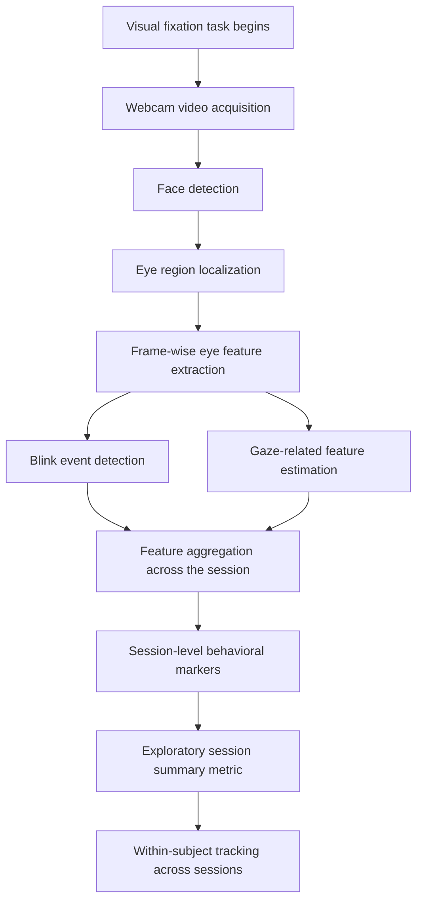
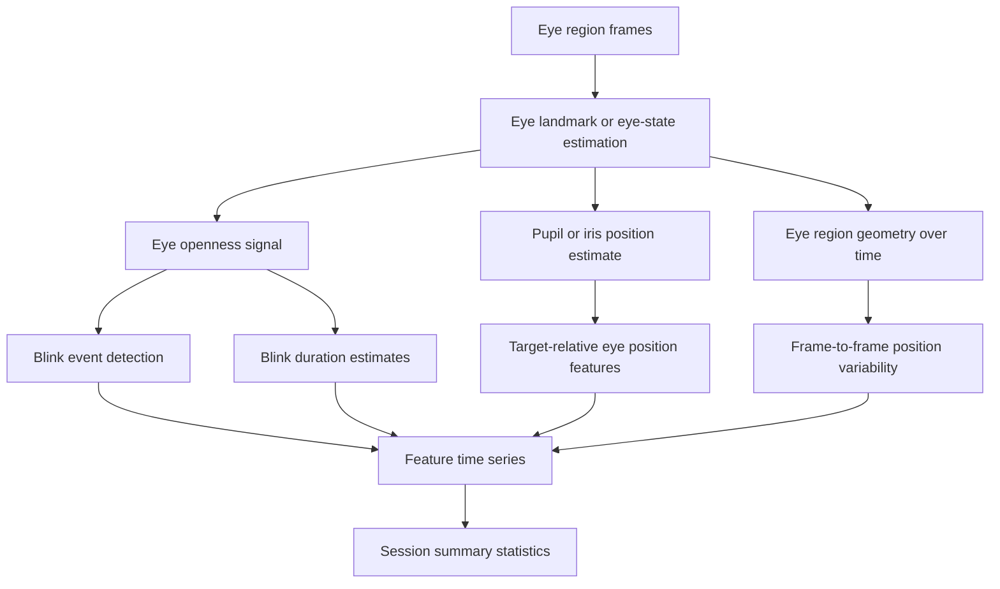
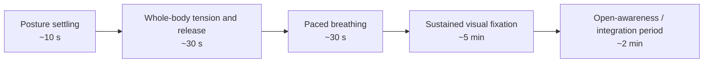
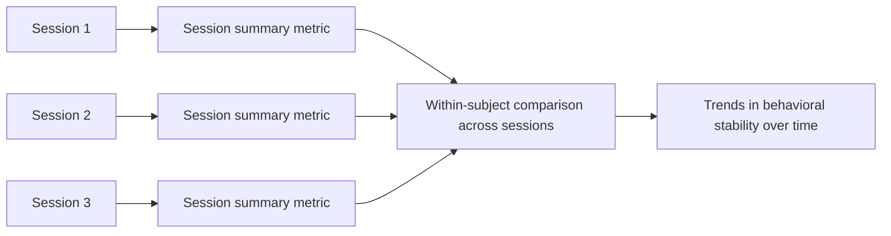

# System Diagrams

This section provides visual summaries of the current prototype design, including the measurement pipeline, eye-feature extraction process, protocol structure, and how repeated sessions might be compared over time.

---

## Figure 1. High-Level Measurement Pipeline

The overall processing pipeline from webcam video acquisition to session-level behavioral summaries.

---

## Figure 2. Eye Feature Extraction Pathway

Example decomposition of eye-region signals into blink-related and target-relative position features.

---

## Figure 3. Protocol Structure

Temporal structure of the current protocol, including preparatory phases, sustained fixation, and post-fixation integration.

---

## Figure 4. Repeated Session Comparison

Conceptual framework for comparing exploratory session metrics within the same individual across multiple sessions.

